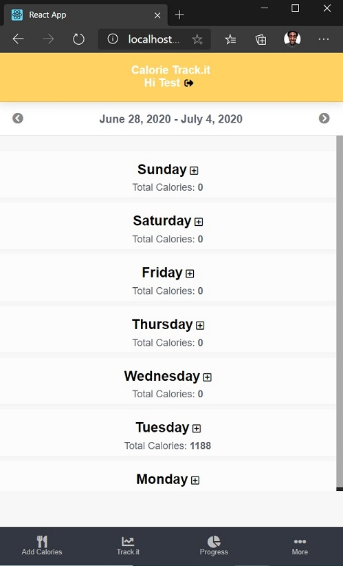
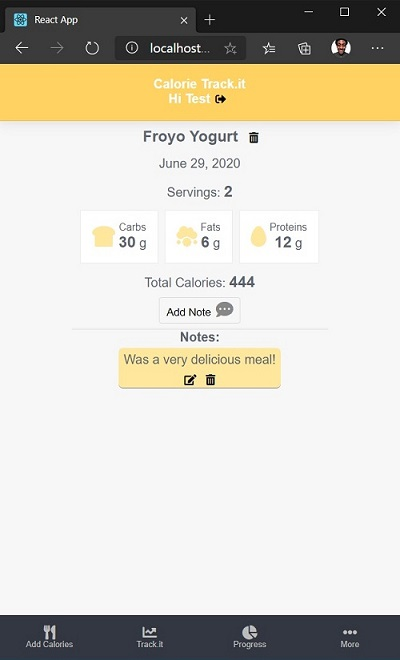

# Redux-TrackingApp-FrontEnd
### Version 1.0 Beta
The Front-end for a Calorie tracking mobile app that connects with a RESTful API through HTTP Requests

Web based Mobile Application using a [custom built API](https://github.com/Aaron-RN/ROR-TrackingApp-API) to gather and manipulate information related to various type of foods.




## [Live Link](https://arn-tracking-app.herokuapp.com/login)

## Built With

- HTML, CSS
- JavaScript
- React.js
- React-Router
- Redux.js
- Redux-Thunk
- NPM Webpack

## Setup for Local use

### Clone Repository

Grab a clone of [this repository](https://github.com/Aaron-RN/Redux-TrackingApp-FrontEnd/tree/v1.0b) from Github

### [Setting up BackEnd](https://github.com/Aaron-RN/ROR-TrackingApp-API/tree/models-controllers)

In order for this application to work you will also need to setup your backEnd server. You can do so following this readme guide [here](https://github.com/Aaron-RN/ROR-TrackingApp-API/tree/models-controllers).

After you have successfully setup your backEnd, you will need to change the URL the frontEnd connects to.

1. Navigate to your local directory of this cloned repository
2. Navigate to the src/redux/actions folder and open the index.js file
3. On line 3 where you would see const ```const URL = 'https://arn-tracking-app-api.herokuapp.com/';```, replace ```'https://arn-tracking-app-api.herokuapp.com/'``` with the url of your backEnd server that you would have setup following the ["Setting up The BackEnd"](https://github.com/Aaron-RN/ROR-TrackingApp-API/tree/models-controllers) Guide

### Install Dependencies

```
$ npm install
```

### Run Application

```
$ npm run server
```

### Running Tests

```
$ npm run test
```

## Running Linters

### ESLint
- Run `npx eslint .` on the root of your project directory.

### Stylelint
- Run `npx stylelint "**/*.{css,scss}"` on the root of your project directory.


## Author

👤 **Aaron Rory**

- Github: [@Aaron-RN](https://github.com/Aaron-RN)
- Twitter: [@ARNewbold](https://twitter.com/ARNewbold)
- Linkedin: [Aaron Newbold](https://www.linkedin.com/in/aaron-newbold-1b9233187/)

## 🤝 Contributing

Contributions, issues and feature requests are welcome!

Feel free to check the [issues page](issues/).

## Show your support

Give a ⭐️ if you like this project!

## 📝 License

This project is [MIT](lic.url) licensed.